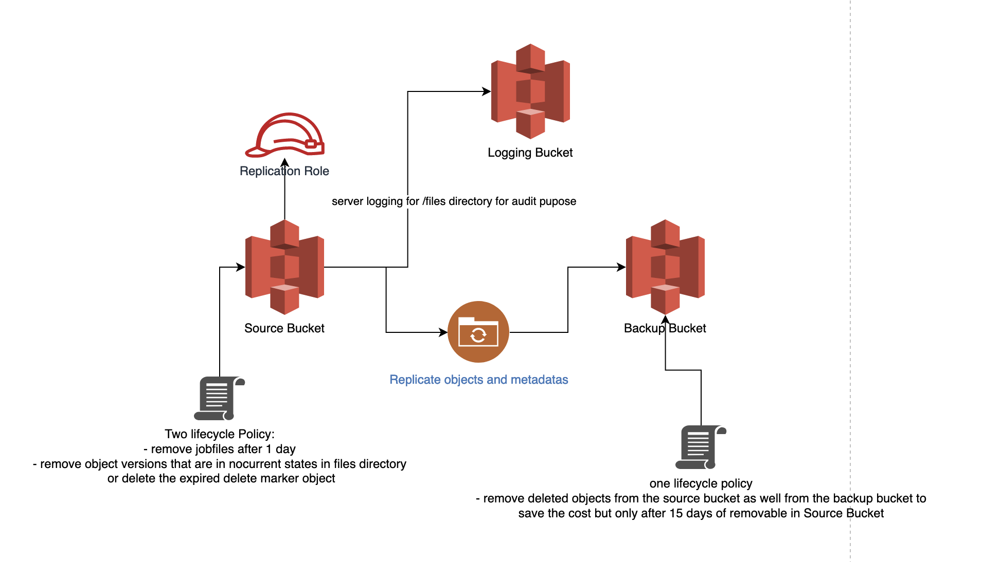
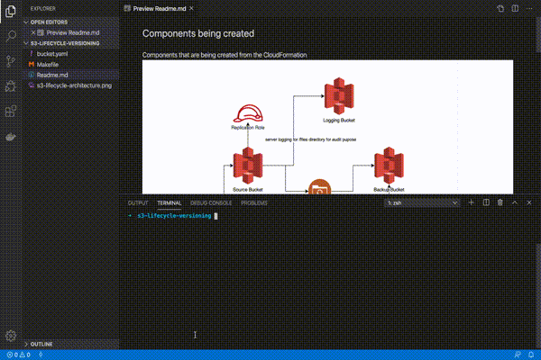

## Components being created
Components that are being created from the CloudFormation


## Creating Stack
- Export Necessary Variables
```
export AWS_REGION=us-east-1 AWS_PROFILE=sandbox
make create-stack
```

- Create Stack
```shell
make create-stack
```

**OR**


```shell
aws cloudformation create-stack --stack-name s3-life-cycle-versioning --template-body file://bucket.yaml --parameters ParameterKey=SourceBucketName,ParameterValue=random-src-bucket124 --capabilities CAPABILITY_IAM --profile ${AWS_PROFILE} --region ${AWS_REGION}
```

- Update Stack
```shell
make update-stack
```

**OR**


```shell
aws cloudformation update-stack --stack-name s3-life-cycle-versioning --template-body file://bucket.yaml --parameters ParameterKey=SourceBucketName,ParameterValue=random-src-bucket124 --capabilities CAPABILITY_IAM --profile ${AWS_PROFILE} --region ${AWS_REGION}
```

- Delete Stack
```shell
make delete-stack
```

**OR**

```shell
aws cloudformation delete-stack --stack-name s3-life-cycle-versioning --profile ${AWS_PROFILE} --region ${AWS_REGION}
```

## Demo

